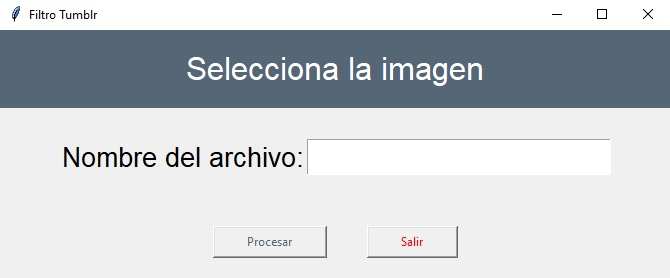
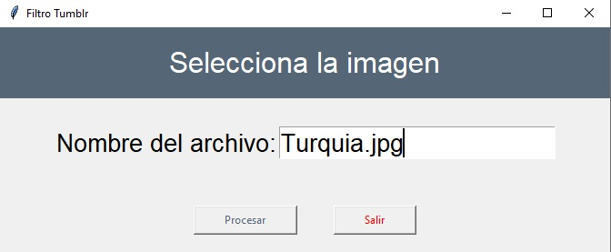
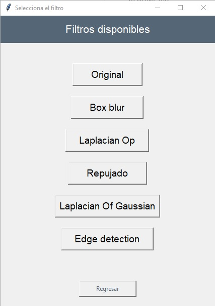
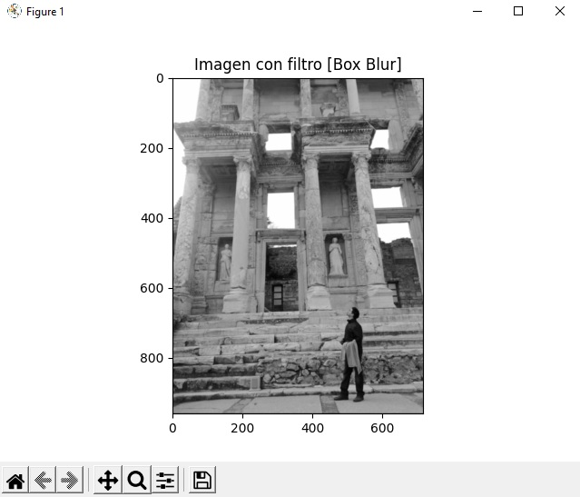

<a href="#">
    
</a>

# EQ8_TC1001S 🚀
Como parte del proyecto para la semana TEC "Herramientas computacionales: el arte de la programación (Gpo 120)", se hizo el presente programa para cumplir las siguientes competencias: 

* **SING0400  Compromiso con la sustentabilidad** 

	_Aplica estándares internacionales y principios de sustentabilidad en la solución de problemas de la ingeniería y ciencias._

* **SING0401 Aplicación de estándares y normas** 

	_Aplica los estándares y normas en el ejercicio de su profesión manteniéndolos como referencia a seguir en la solución de problemas de ingeniería y ciencias._

El programa cumple la función de aplicar diferentes filtros a una imagen especificada con su nombre, pudiendo tener varias aplicaciones en áreas transversales a la nuestra. Siguiendo con los estándares establecidos y con un control de versiones bien aplicado. 

## Uso del proyecto

### Prerrequisitos

Le proyecto está programado en el lenguaje python, este puede ser descargado de la siguiente liga: https://www.python.org/downloads/, y posteriormente ser agregado al PATH de la computadora. Además de python es necesario instalar ciertas librerías para asegurar que el script funcione adecuadamente, esto se puede realizar utilizando PIP. Las librerías de python necesarias son las siguientes:

* OpenCV
	```sh
	pip install opencv-python
	```
* Numpy
	```sh
	pip install numpy
	```
* Matplotlib
	```sh
	pip install matplotlib
	```
* Tkinter (normalmente se insatla automáticamente con Python)
	```sh
	pip install tk
	```

### Corrida
Usando la línea de comandos es necesario posicionarse en la carpeta del proyecto, para ello se puede utilizar el comando cd, un ejemplo sería:
```sh
	cd C:\Users\usr\Proyectos\EQ8_TC1001S
```

Posteriormente, para correr el script se debe ingresar el siguiente comando en la terminal que se esté usando:

```sh
	python main_root.py
```

Al correr el programa, se desplegará una ventana similar a la siguiente:

<p align="center">
  
</p>

En la casilla se debe ingresar el nombre de la imagen que se desee utilizar para aplicar los diferentes filtros(_**Nota:** la imagen debe estar en la misma carpeta que el archivo main_root.py_). Utilizando la imagen incluida de prueba, esto se vería de la siguiente manera:

<p align="center">
  
</p>

Posteriormente se debe hacer clic en el boton **Procesar**, lo cuál desplegará una nueva ventana si la entrada en la casilla es válida:

<p align="center">
  
</p>

Finalmente, solo es necesario hacer clic sobre el botón que se desee para aplicar dicho filtro sobre la imagen (transformada a escala de grises si es necesario), esto generará una ventana emergente con la imagen nueva.

<p align="center">
  
</p>


## Autores ✒️

Este proyecto es realizado para la Semana TEC "Herramientas computacionales: el arte de la programación (Gpo 120)" por :
* Ian García - A01706892
* Emiliano Vásquez Olea- A01707035
* José Ángel Rico Mendieta - A01707404

## Referencias
Sinha, U. (s. f.). Convolutions: Image convolution examples - AI Shack. Recuperado 5 de mayo de 2021, de:  
https://aishack.in/tutorials/image-convolution-examples/

Repositorio de apoyo:
https://github.com/benjaminva/Sobel_Filter/tree/main
